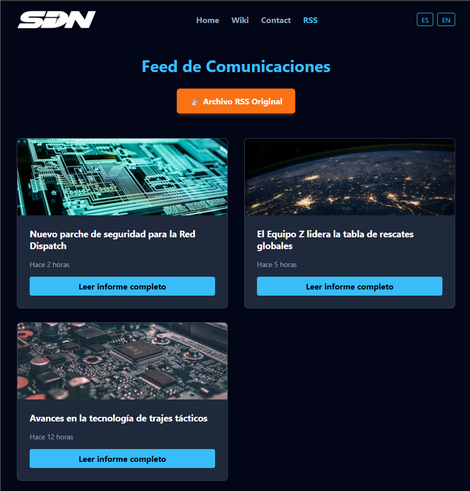

# DISPATCH FAN PROJECT

## Tercera Entrega

**URL del Proyecto en Firebase Hosting:** (https://dispatch-web-ard.web.app/rss)

**Pantallazo del Lector RSS:**

## About The Project
This project is a fan-made website dedicated to the video game "Dispatch". It serves as an interactive wiki and information portal about the game's universe, characters, and mechanics.

The Main Page is designed to immerse the user immediately:

- Hero Section: Features a full-width dramatic background with a call-to-action, setting the tense atmosphere of emergency dispatching.

- Character Roster: Dynamically renders character cards from a JSON dataset. The roster is divided into three distinct sections: Team Z, Superhero Dispatch Network, and Villains, allowing users to visualize the different factions of the game.

- Responsive Design: The layout automatically adjusts from a grid view on desktop to a column view on mobile devices using Flexbox and Media Queries.

## Built With
This project was built using the following third-party components and libraries:

- React - The library for web and native user interfaces.

- Vite - Next Generation Frontend Tooling.

- React Leaflet - Used in the Contact page to display the HQ location on an interactive map.

- i18next - For multi-language support (English/Spanish).

- React Router Dom - For client-side navigation.

## Getting Started
To get a local copy up and running follow these simple steps.

### Installation

Clone the repo git clone https://github.com/your_username/dispatch-project.git

Install NPM packages npm install

Start the development server npm run dev

## Usage
The application consists of three main navigation routes:

Home (/home): The landing page showcasing the game summary and character cards divided by factions.

Wiki (/characters): A detailed database of all characters (Heroes and Villains) combined in a single view.

Contact (/contact): A functional form layout and an interactive map powered by Leaflet showing the fictional headquarters.

You can toggle the language between English and Spanish using the buttons in the Header.

## Contact
Alejandro Ruiz Díaz - alejandroruizdiaz@alumno.ieselrincon.es

## Acknowledgments
I would like to express my gratitude to the React and Firebase developer communities for their excellent, comprehensive documentation which greatly assisted in the development of this project.

## Tutorials Used
- React Router DOM configuration: https://reactrouter.com/en/main/start/tutorial
- Firebase Firestore integration: https://firebase.google.com/docs/firestore/quickstart

## Design Inspiration
The dark theme, layout structure, and component styling were inspired by this Figma community UI kit:
https://www.figma.com/community/file/1020338048666327318/dark-mode-dashboard-ui-kit